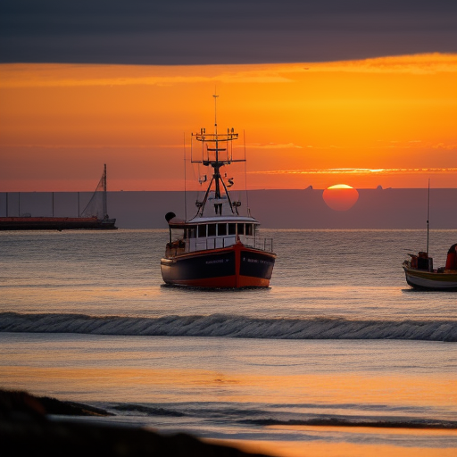
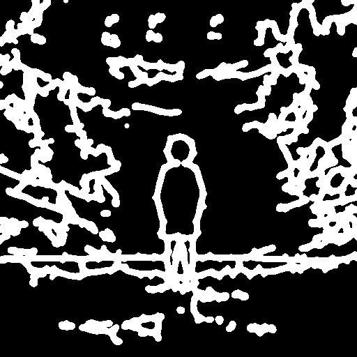
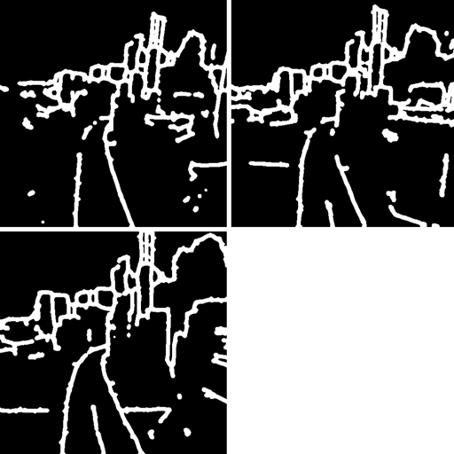

# AnimateDiff based on MindSpore

This repository is the MindSpore implementation of [AnimateDiff](https://arxiv.org/abs/2307.04725).

## Features

- [x] Text-to-video generation with AnimdateDiff v2, supporting 16 frames @512x512 resolution on Ascend 910B, 16 frames @256x256 resolution on GPU 3090
- [x] MotionLoRA inference
- [x] AnimateDiff v3
- [ ] Motion Module Training
- [ ] Motion LoRA Training

## Requirements

```
pip install -r requirements.txt
```

In case `decord` package is not available in your environment, try `pip install eva-decord`.
Instruction on ffmpeg and decord install on EulerOS:
```
1. install ffmpeg 4, referring to https://ffmpeg.org/releases
    wget wget https://ffmpeg.org/releases/ffmpeg-4.0.1.tar.bz2 --no-check-certificate
    tar -xvf ffmpeg-4.0.1.tar.bz2
    mv ffmpeg-4.0.1 ffmpeg
    cd ffmpeg
    ./configure --enable-shared         # --enable-shared is needed for sharing libavcodec with decord
    make -j 64
    make install
2. install decord, referring to https://github.com/dmlc/decord?tab=readme-ov-file#install-from-source
    git clone --recursive https://github.com/dmlc/decord
    cd decord
    rm build && mkdir build && cd build
    cmake .. -DUSE_CUDA=0 -DCMAKE_BUILD_TYPE=Release
    make -j 64
    make install
    cd ../python
    python3 setup.py install --user
```


## Prepare Model Weights

First, download the torch pretrained weights referring to [torch animatediff checkpoints](https://github.com/guoyww/AnimateDiff/blob/main/__assets__/docs/animatediff.md#download-base-t2i--motion-module-checkpoints).

- Convert SD dreambooth model

To download ToonYou-Beta3 dreambooth model, please refer to this [civitai website](https://civitai.com/models/30240?modelVersionId=78775), or use the following command:
```
wget https://civitai.com/api/download/models/78755 -P models/torch_ckpts/ --content-disposition --no-check-certificate
```
After downloading this dreambooth checkpoint under `animatediff/models/torch_ckpts/`, convert the dreambooth checkpoint using:
```
cd ../examples/stable_diffusion_v2
python tools/model_conversion/convert_weights.py  --source ../animatediff/models/torch_ckpts/toonyou_beta3.safetensors   --target models/toonyou_beta3.ckpt  --model sdv1  --source_version pt
```

In addition, please download [RealisticVision V5.1](https://civitai.com/models/4201?modelVersionId=130072) dreambooth checkpoint and convert it similarly.

- Convert Motion Module
```
cd ../examples/animatediff/tools
python motion_module_convert.py --src ../torch_ckpts/mm_sd_v15_v2.ckpt --tar ../models/motion_module
```

If converting the animatediff v3 motion module checkpoint,
```
cd ../examples/animatediff/tools
python motion_module_convert.py -v v3 --src ../torch_ckpts/v3_sd15_mm.ckpt  --tar ../models/motion_module
```

- Convert Motion LoRA
```
cd ../examples/animatediff/tools
python motion_lora_convert.py --src ../torch_ckpts/.ckpt --tar ../models/motion_lora
```

- Convert Domain Adapter LoRA
```
cd ../examples/animatediff/tools
python domain_adapter_lora_convert.py --src ../torch_ckpts/v3_sd15_adapter.ckpt --tar ../models/domain_adapter_lora
```

- Convert SparseCtrl Encoder
```
cd ../examples/animatediff/tools
python sparsectrl_encoder_convert.py --src ../torch_ckpts/v3_sd15_sparsectrl_{}.ckpt --tar ../models/sparsectrl_encoder
```

The full tree of expected checkpoints is shown below:
```
models
├── domain_adapter_lora
│   └── v3_sd15_adapter.ckpt
├── dreambooth_lora
│   ├── realisticVisionV51_v51VAE.ckpt
│   └── toonyou_beta3.ckpt
├── motion_lora
│   └── v2_lora_ZoomIn.ckpt
├── motion_module
│   ├── mm_sd_v15.ckpt
│   ├── mm_sd_v15_v2.ckpt
│   └── v3_sd15_mm.ckpt
├── sparsectrl_encoder
│   ├── v3_sd15_sparsectrl_rgb.ckpt
│   └── v3_sd15_sparsectrl_scribble.ckpt
└── stable_diffusion
    └── sd_v1.5-d0ab7146.ckpt
```
## Inference (AnimateDiff v3 and SparseCtrl)

- Running On Ascend 910\*:
```
# under general T2V setting
python text_to_video.py --config configs/prompts/v3/v3-1-T2V.yaml

# image animation (on RealisticVision)
python text_to_video.py --config configs/prompts/v3/v3-2-animation-RealisticVision.yaml

# sketch-to-animation and storyboarding (on RealisticVision)
python text_to_video.py --config configs/prompts/v3/v3-3-sketch-RealisticVision.yaml
```

By default, DDIM sampling is used, and the sampling speed is s/iter.

Results:

<table class="center">
    <tr style="line-height: 0">
    <td width=25% style="border: none; text-align: center">Input (by RealisticVision)</td>
    <td width=25% style="border: none; text-align: center">Animation</td>
    <td width=25% style="border: none; text-align: center">Input</td>
    <td width=25% style="border: none; text-align: center">Animation</td>
    </tr>
    <tr>
    <td width=25% style="border: none"></td>
    <td width=25% style="border: none"></td>
    <td width=25% style="border: none"></td>
    <td width=25% style="border: none"></td>
    </tr>
</table>

<table class="center">
    <tr style="line-height: 0">
    <td width=25% style="border: none; text-align: center">Input Scribble</td>
    <td width=25% style="border: none; text-align: center">Output</td>
    <td width=25% style="border: none; text-align: center">Input Scribbles</td>
    <td width=25% style="border: none; text-align: center">Output</td>
    </tr>
    <tr>
      <td width=25% style="border: none"></td>
      <td width=25% style="border: none"></td>
      <td width=25% style="border: none"></td>
      <td width=25% style="border: none"></td>
    </tr>
</table>

- Running on GPU:

Please append `--device_target GPU` to the end of the commands above.

## Inference (AnimateDiff v2)

### Text-to-Video

- Running On Ascend 910\*:
```
python text_to_video.py --config configs/prompts/v2/1-ToonYou.yaml --L 16 --H 512 --W 512
```

By default, DDIM sampling is used, and the sampling speed is 1.07s/iter.

Results:

<p float="left">


</p>


- Running on GPU:
```
python text_to_video.py --config configs/prompts/v2/1-ToonYou.yaml --L 16 --H 256 --W 256 --device_target GPU
```

### Motion LoRA
- Running On Ascend 910\*:
```
python text_to_video.py --config configs/prompts/v2/1-ToonYou-MotionLoRA.yaml --L 16 --H 512 --W 512
```

By default, DDIM sampling is used, and the sampling speed is 1.07s/iter.

Results using Zoom-In motion lora:

<p float="left">


</p>


- Running on GPU:
```
python text_to_video.py --config configs/prompts/v2/1-ToonYou-MotionLoRA.yaml --L 16 --H 256 --W 256 --device_target GPU
```

## Training

### Image Finetuning

```
python train.py --config configs/training/image_finetune.yaml
```
> For 910B, please set `export MS_ASCEND_CHECK_OVERFLOW_MODE="INFNAN_MODE"` before running training.


### Motion Module Training

```
python train.py --config configs/training/mmv2_train.yaml
```
> For 910B, please set `export MS_ASCEND_CHECK_OVERFLOW_MODE="INFNAN_MODE"` before running training.

You may change the arguments including data path, output directory, lr, etc in the yaml config file. You can also change by command line arguments referring to `args_train.py` or `python train.py --help`

- Evaluation
Inference with the trained model:
```
python text_to_video.py --config configs/prompt/v2/base_video.yaml \
    --motion_module_path {path to saved checkpoint} \
    --prompt  {text prompt}  \
```

You can also create a new config yaml to specify the prompts to test and the motion moduel path based on `configs/prompt/v2/base_video.yaml`.


### Motion LoRA Training

```
python train.py --config configs/training/mmv2_lora.yaml
```
> For 910B, please set `export MS_ASCEND_CHECK_OVERFLOW_MODE="INFNAN_MODE"` before running training.


- Inference with the trained model:
```
python text_to_video.py --config configs/prompt/v2/base_video.yaml \
    --motion_lora_path {path to saved checkpoint} \
    --prompt  {text prompt}  \
```


### Training on GPU

Please add `--device_target GPU` in the above training commands and adjust `image_size`/`num_frames`/`train_batch_size` to fit your device memory, if you wan to run on GPUs. Below is an example for 3090.

```
# reduce num frames and batch size to avoid OOM in 3090
python train.py --config configs/training/mmv2_train.yaml --data_path ../videocomposer/datasets/webvid5 --image_size 256 --num_frames=4 --device_target GPU --train_batch_size=1
```
