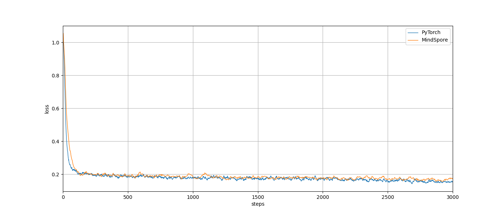

# **MindSpore基础教程： 模型迁移训练**

本文章是MindSpore基础教程之一： 模型迁移训练，以DiT(Scalable Diffusion Models with Transformers)模型为例。通过阅读本教程，您将了解如何将PyTorch模型的推理和训练代码迁移到MindSpore框架中，并且实现相同的精度和性能。

## DiT模型迁移任务目标

DiT是一类基于Transformer架构的深度生成模型，相比Stable Diffusion这类使用U-Net骨干网络的生成模型，DiT的扩展性更好，吸引了非常多的关注。因此，本文以DiT模型为例，介绍如何将PyTorch的代码迁移为MindSpore的代码。总体目标是实现在NPU设备上，利用MindSpore框架进行DiT的训练，并且达到和PyTorch框架相同的训练精度。

在相同的输入前提下，PyTorch和MindSpore的推理结果应保持一致。在相同的训练数据集，超参配置和损失函数下，PyTorch和MindSpore的训练精度应保持大致相同。但是，由于数据增强和模型初始化的随机性，最终达到的收敛精度可能存在细微差异，这属于可以接受的误差范围。

## 迁移任务具体步骤
迁移任务包含以下步骤：
- 迁移准备工作：准备合适的运行环境，用于推理和训练的数据集，分析并运行PyTorch代码；
- 模型前向对齐：对PyTorch模型代码进行转换，进行PyTorch模型权重进行转换，验证模型组网正确性；
- 数据读取转换：对PyTorch数据读取代码进行转换；
- 模型训练对齐：对齐损失函数、超参和学习率，验证训练精度；

# **迁移准备工作**

## 安装MindSpore、PyTorch

安装MindSpore，具体操作请参考[MindSpore官网](https://www.mindspore.cn/install)。本文中使用到的MindSpore版本为2.5.0, CANN 版本为CANN 8.0.RC3。

安装完成以后，请输入运行python，然后输入以下的命令：
```bash
import mindspore as ms
ms.run_check()
```
如果出现以下的输出内容，说明MindSpore安装成功。
```bash
MindSpore version: 2.5.0
The result of multiplication caclulation is correct, MindSpore has been installed on platform [Ascend] successfully!
```

安装PyTorch，具体操作请参考[PyTorch官网](https://pytorch.org/get-started/locally/)。 本文中使用到的PyTorch版本为2.5.1，CUDA 版本为12.8。

安装完成以后，请输入运行python，然后输入以下的命令：
```bash
import torch
print(torch.__version__)
print(torch.cuda.is_available())
print(torch.Tensor([0.0]).cuda())
```
如果输出结果正常，则表示PyTorch安装成功。


## 准备cat-dog数据集

从对齐精度的角度考虑，训练数据集我们选择一个小数据集，即cat-dog数据集。该数据集中包含400张图片，只有两个分类： ${"0": "cat", "1": "dog"}$。该数据集可以通过`huggingface-cli`从命令行下载。首先用下面的命令进行安装：
```bash
pip install -U "huggingface_hub[cli]"
```

然后在工作目录下下载数据集：
```bash
huggingface-cli download jasonhuang23/cat_dog_tiny --repo-type dataset --local-dir ./datasets/
```

下载完成后，用`tree datasets/`检查数据集的目录结构, 得到如下的结果：
```bash
datasets/
├── cat
│   ├── 0.jpg
│   ├── 1.jpg
│    ...
├── dog
│   ├── 0.jpg
│   ├── 1.jpg
│    ...
└── labels.csv
```
其中， `labels.csv`是一个只有两列的CSV文件，第一列为图片相对路径，第二列为图片的标签。如下所示：
| image_path | label |
| ---------- | ----- |
|cat/0.jpg | 0 |
|dog/0.jpg | 1 |

## 下载并分析代码

MindSpore的训练代码在`mindone/examples/dit`中, 请使用如下的命令下载代码：
```bash
git clone https://github.com/mindspore-lab/mindone.git
cd examples/dit
pip install -r requirements.txt
```
`examples/dit` 是主要的工作目录。请把数据集`datasets/`放置到`examples/dit`目录下。


PyTorch代码库请参考：[DiT](https://github.com/facebookresearch/DiT)。请首先下载代码库并安装PyTorch依赖项：
```bash
cd examples/dit
git clone https://github.com/facebookresearch/DiT.git
cd DiT
conda env create -f environment.yml
conda activate DiT
```

PyTorch的训练代码是`DiT/train.py`。在运行训练代码之前，我们首先分析一下训练代码，以了解训练代码的运行逻辑。

训练的初始阶段，首先对DiT模型进行初始化，并创建一个ema模型, 用于在训练过程中对模型参数进行ema更新。VAE是一个变分自编码器，用于对图像进行编码和解码。diffusion则定义了训练中会用到的noise scheduler 和timesteps， 同时在`diffusion.training_losses`中，还定义了训练使用到的损失函数，默认为MSE(Mean Squared Error)。模型采用AdamW优化器，learning rate 为1e-4, weight decay为0。
```python
    # Create model:
    assert args.image_size % 8 == 0, "Image size must be divisible by 8 (for the VAE encoder)."
    latent_size = args.image_size // 8
    model = DiT_models[args.model](
        input_size=latent_size,
        num_classes=args.num_classes
    )
    # Note that parameter initialization is done within the DiT constructor
    ema = deepcopy(model).to(device)  # Create an EMA of the model for use after training
    requires_grad(ema, False)
    model = DDP(model.to(device), device_ids=[rank])
    diffusion = create_diffusion(timestep_respacing="")  # default: 1000 steps, linear noise schedule
    vae = AutoencoderKL.from_pretrained(f"stabilityai/sd-vae-ft-{args.vae}").to(device)
    logger.info(f"DiT Parameters: {sum(p.numel() for p in model.parameters()):,}")

    opt = torch.optim.AdamW(model.parameters(), lr=1e-4, weight_decay=0)
```
数据集相关代码将在下一章节详细介绍。

进行损失函数计算和模型参数更新时，会调用`diffusion.training_losses`和`opt.step()`：
```python
    for epoch in range(args.epochs):
        sampler.set_epoch(epoch)
        logger.info(f"Beginning epoch {epoch}...")
        for x, y in loader:
            x = x.to(device)
            y = y.to(device)
            with torch.no_grad():
                # Map input images to latent space + normalize latents:
                x = vae.encode(x).latent_dist.sample().mul_(0.18215)
            t = torch.randint(0, diffusion.num_timesteps, (x.shape[0],), device=device)
            model_kwargs = dict(y=y)
            loss_dict = diffusion.training_losses(model, x, t, model_kwargs)
            loss = loss_dict["loss"].mean()
            opt.zero_grad()
            loss.backward()
            opt.step()
            update_ema(ema, model.module)
```

启动N卡并行训练的命令为：
```bash
cd DiT/
torchrun --nnodes=1 --nproc_per_node=N train.py --model DiT-XL/2 --data-path ../datasets/
```
默认的图片大小为(256, 256)。

# **模型前向对齐**
模型前向对齐是指，在输入相同的情况下，PyTorch模型和MindSpore模型也载入相同的权重，两个模型的输出结果也相同。

## 转换网络结构代码

PyTorch DiT模型代码：[facebookresearch/DiT](https://github.com/facebookresearch/DiT/blob/main/models.py)。

经过转换后，MindSpore DiT模型代码：[mindspore-lab/mindone](https://github.com/mindspore-lab/mindone/blob/master/mindone/models/dit.py)。


DiT 是一个以 Transformer Block `DiTBlock`为主要结构的 Vision Transformer。我们截取了`DiTBlock`的PyTorch和MindSpore代码进行对比，来展示模型代码转换的主要过程。

<table>
<tr>
<th> Torch </th>
<th> MindSpore </th>
</tr>
<tr>
<td>

```python
class DiTBlock(nn.Module):
    """
    A DiT block with adaptive layer norm zero (adaLN-Zero) conditioning.
    """
    def __init__(self, hidden_size, num_heads, mlp_ratio=4.0, **block_kwargs):
        super().__init__()
        self.norm1 = nn.LayerNorm(hidden_size, elementwise_affine=False, eps=1e-6)
        self.attn = Attention(hidden_size, num_heads=num_heads, qkv_bias=True, **block_kwargs)
        self.norm2 = nn.LayerNorm(hidden_size, elementwise_affine=False, eps=1e-6)
        mlp_hidden_dim = int(hidden_size * mlp_ratio)
        approx_gelu = lambda: nn.GELU(approximate="tanh")
        self.mlp = Mlp(in_features=hidden_size, hidden_features=mlp_hidden_dim, act_layer=approx_gelu, drop=0)
        self.adaLN_modulation = nn.Sequential(
            nn.SiLU(),
            nn.Linear(hidden_size, 6 * hidden_size, bias=True)
        )

    def forward(self, x, c):
        shift_msa, scale_msa, gate_msa, shift_mlp, scale_mlp, gate_mlp = self.adaLN_modulation(c).chunk(6, dim=1)
        x = x + gate_msa.unsqueeze(1) * self.attn(modulate(self.norm1(x), shift_msa, scale_msa))
        x = x + gate_mlp.unsqueeze(1) * self.mlp(modulate(self.norm2(x), shift_mlp, scale_mlp))
        return x
```

</td>
<td>

```python
class DiTBlock(nn.Cell):
    """
    A DiT block with adaptive layer norm zero (adaLN-Zero) conditioning.
    """

    def __init__(self, hidden_size, num_heads, mlp_ratio=4.0, **block_kwargs):
        super().__init__()
        self.norm1 = mint.nn.LayerNorm(hidden_size, elementwise_affine=False, eps=1e-6)
        self.attn = SelfAttention(hidden_size, num_heads=num_heads, qkv_bias=True, **block_kwargs)
        self.norm2 = mint.nn.LayerNorm(hidden_size, elementwise_affine=False, eps=1e-6)
        mlp_hidden_dim = int(hidden_size * mlp_ratio)
        approx_gelu = lambda: GELU(approximate="tanh")
        self.mlp = Mlp(in_features=hidden_size, hidden_features=mlp_hidden_dim, act_layer=approx_gelu, drop=0)
        self.adaLN_modulation = nn.SequentialCell(
            mint.nn.SiLU(), mint.nn.Linear(hidden_size, 6 * hidden_size, bias=True)
        )

    def construct(self, x, c):
        shift_msa, scale_msa, gate_msa, shift_mlp, scale_mlp, gate_mlp = mint.chunk(self.adaLN_modulation(c), 6, dim=1)
        x = x + gate_msa.unsqueeze(1) * self.attn(modulate(self.norm1(x), shift_msa, scale_msa))
        x = x + gate_mlp.unsqueeze(1) * self.mlp(modulate(self.norm2(x), shift_mlp, scale_mlp))
        return x
```

</td>
</tr>
</table>

请参考[PyTorch与MindSpore API映射表](https://www.mindspore.cn/docs/zh-CN/master/note/api_mapping/pytorch_api_mapping.html)，按照以下的步骤进行转换：
1. 将`nn.Module`替换为`nn.Cell`, 同时将`def forward`替换成`def construct`。
2. 对于单层Layer，在[PyTorch与MindSpore API映射表](https://www.mindspore.cn/docs/zh-CN/master/note/api_mapping/pytorch_api_mapping.html)中找到对应的MindSpore API， 替换成对应的代码。 例如`nn.Linear`, `nn.Linear`替换成`mint.nn.Linear`。
3. 对于不能直接进行API替换的Layer, 例如PyTorch代码中调用的`from timm.models.vision_transformer import PatchEmbed, Attention, Mlp`，都需要找到对应的PyTorch源码，重复步骤2，进行代码转换。经过转换后的MindSpore： [PatchEmbed](https://github.com/mindspore-lab/mindone/blob/master/mindone/models/dit.py#L41), [Attention](https://github.com/mindspore-lab/mindone/blob/master/mindone/models/dit.py#L158), [Mlp](https://github.com/mindspore-lab/mindone/blob/master/mindone/models/dit.py#L132)。
4. MindSpore 的权重初始化方式和PyTorch的权重初始化方式有细微不同。PyTorch的初始化常常调用`torch.nn.init`的相关接口, 并使用`Tensor.copy_`来进行赋值。MindSpore初始化常常调用`mindspore.common.initializer`的相关接口，并且使用`Parameter.set_data`来进行权重赋值。下面展示PyTorch和MindSpore初始化权重的代码。


<table>
<tr>
<th> Torch </th>
<th> MindSpore </th>
</tr>
<tr>
<td>

```python
    def initialize_weights(self):
        # Initialize transformer layers:
        def _basic_init(module):
            if isinstance(module, nn.Linear):
                torch.nn.init.xavier_uniform_(module.weight)
                if module.bias is not None:
                    nn.init.constant_(module.bias, 0)
        self.apply(_basic_init)

        # Initialize (and freeze) pos_embed by sin-cos embedding:
        pos_embed = get_2d_sincos_pos_embed(self.pos_embed.shape[-1], int(self.x_embedder.num_patches ** 0.5))
        self.pos_embed.data.copy_(torch.from_numpy(pos_embed).float().unsqueeze(0))

        # Initialize patch_embed like nn.Linear (instead of nn.Conv2d):
        w = self.x_embedder.proj.weight.data
        nn.init.xavier_uniform_(w.view([w.shape[0], -1]))
        nn.init.constant_(self.x_embedder.proj.bias, 0)

        # Initialize label embedding table:
        nn.init.normal_(self.y_embedder.embedding_table.weight, std=0.02)

        # Initialize timestep embedding MLP:
        nn.init.normal_(self.t_embedder.mlp[0].weight, std=0.02)
        nn.init.normal_(self.t_embedder.mlp[2].weight, std=0.02)

        # Zero-out adaLN modulation layers in DiT blocks:
        for block in self.blocks:
            nn.init.constant_(block.adaLN_modulation[-1].weight, 0)
            nn.init.constant_(block.adaLN_modulation[-1].bias, 0)

        # Zero-out output layers:
        nn.init.constant_(self.final_layer.adaLN_modulation[-1].weight, 0)
        nn.init.constant_(self.final_layer.adaLN_modulation[-1].bias, 0)
        nn.init.constant_(self.final_layer.linear.weight, 0)
        nn.init.constant_(self.final_layer.linear.bias, 0)
```

</td>
<td>

```python
    from .utils import xavier_uniform_, constant_, normal_
    def initialize_weights(self):
        # Initialize transformer layers:
        def _basic_init(module):
            if isinstance(module, mint.nn.Linear):
                xavier_uniform_(module.weight)
                if module.bias is not None:
                    constant_(module.bias, 0)

        self.apply(_basic_init)

        # Initialize (and freeze) pos_embed by sin-cos embedding:
        pos_embed = get_2d_sincos_pos_embed(self.pos_embed.shape[-1], int(self.x_embedder.num_patches**0.5))
        self.pos_embed.set_data(Tensor(pos_embed).float().unsqueeze(0))

        # Initialize patch_embed like nn.Linear (instead of nn.Conv2d):
        w = self.x_embedder.proj.weight
        # xavier_uniform_(w.view(w.shape[0], -1))
        w_flatted = w.view(w.shape[0], -1)
        w.set_data(initializer(XavierUniform(), w_flatted.shape, w_flatted.dtype).reshape(w.shape))
        constant_(self.x_embedder.proj.bias, 0)

        # Initialize label embedding table:
        normal_(self.y_embedder.embedding_table.weight, std=0.02)

        # Initialize timestep embedding MLP:
        normal_(self.t_embedder.mlp[0].weight, std=0.02)
        normal_(self.t_embedder.mlp[2].weight, std=0.02)

        # Zero-out adaLN modulation layers in DiT blocks:
        for block in self.blocks:
            constant_(block.adaLN_modulation[-1].weight, 0)
            constant_(block.adaLN_modulation[-1].bias, 0)

        # Zero-out output layers:
        constant_(self.final_layer.adaLN_modulation[-1].weight, 0)
        constant_(self.final_layer.adaLN_modulation[-1].bias, 0)
        constant_(self.final_layer.linear.weight, 0)
        constant_(self.final_layer.linear.bias, 0)
```

</td>
</tr>
</table>

其中MindSpore调用的初始化函数`xavier_uniform_`, `constant_`, `normal_`，参考[utils.py](https://github.com/mindspore-lab/mindone/blob/master/mindone/models/utils.py)。

## 进行权重转换

在运行MindSpore模型前，需要先将PyTorch模型权重转换成MindSpore权重，核心代码是将PyTorch的权重Tensor转换成MindSpore的权重Tensor,并且保存为$.ckpt$文件：
```python
def torch_to_ms_weight(source_fp, target_fp):
    source_data = load_torch_ckpt(source_fp)
    target_data = []
    for _name_pt in source_data:
        _source_data = source_data[_name_pt].cpu().detach().numpy()
        target_data.append({"name": _name_pt, "data": ms.Tensor(_source_data)})
    ms.save_checkpoint(target_data, target_fp)
```

请参考[DiT的官方仓库](https://github.com/facebookresearch/DiT)提供的链接，下载预训练模型权重。目前，只有两个ckpt`DiT-XL-2-256x256`和`DiT-XL-2-512x512`可用。

下载`DiT-XL-2-{}x{}.pt`文件后，请将其放置在`examples/dit/models/`文件夹下，然后运行[tools/dit_converter.py](https://github.com/mindspore-lab/mindone/blob/master/examples/dit/tools/dit_converter.py)。例如，要转换`models/DiT-XL-2-256x256.pt`，您可以运行以下命令：
```bash
cd examples/dit/
python tools/dit_converter.py --source models/DiT-XL-2-256x256.pt --target models/DiT-XL-2-256x256.ckpt
```

此外，还请从[huggingface/stabilityai.co](https://huggingface.co/stabilityai/sd-vae-ft-mse/tree/main)下载VAE权重文件，并利用[tools/vae_converter.py](https://github.com/mindspore-lab/mindone/blob/master/examples/dit/tools/vae_converter.py)进行转换：
```bash
cd examples/dit/
python tools/vae_converter.py --source path/to/vae/ckpt --target models/sd-vae-ft-mse.ckpt
```

转换后，在`examples/dit/models/`下的ckpt应如下所示：
```bash
models/
├── DiT-XL-2-256x256.ckpt
├── DiT-XL-2-512x512.ckpt
├── DiT-XL-2-256x256.pt
├── DiT-XL-2-512x512.pt
├── diffusion_pytorch_model.bin  # vae
└── sd-vae-ft-mse.ckpt
```

经过数据集准备和权重转换后，文件夹的结构应该如下所示：
```bash
mindone/examples/dit/
├── models/
│   ├── DiT-XL-2-256x256.ckpt
│   ├── DiT-XL-2-256x256.pt
│   └── ...
├── datasets/
│   ├── cat/
│   ├── dog/
│   └── labels.csv
├── ...
├── DiT/  # torch repository
├── tests/
└── tools/
```

## 验证模型组网正确性

为了验证模型组网的正确性，我们需要首先控制两个模型的权重相同。 两个模型分别载入`models/DiT-XL-2-256x256.pt`和`models/DiT-XL-2-256x256.ckpt`， 以确保两个模型的权重相同。其次，我们需要控制模型的输入相同。DiT模型的输入包括：潜在噪声`x`、标签`y`和噪声时间步`t`。

我们首先运行在`examples/dit/`目录下，运行Pytorch的前向结果：
```bash
python tests/run_torch_dit.py
```
上述命令会初始化一个PyTorch的DiT模型，并载入`models/DiT-XL-2-256x256.pt`权重文件。随机初始化`x`,`y`和`t`并且将这些输入保存到`pt_inputs.npz`文件中。随后执行模型前向，将PyTorch模型的前向输出保存到`pt_output.npy`文件中。

随后，我们运行MindSpore的前向结果：
```bash
python tests/run_ms_dit.py
```
上述命令会初始化一个MindSpore的DiT模型，并载入`models/DiT-XL-2-256x256.ckpt`权重文件。通过载入`pt_inputs.npz`文件来保证两个模型的输入完全相同。随后执行模型前向，将MindSpore模型的前向输出保存到`ms_output.npy`文件中。

最后对比两个输出：
```bash
python tests/compare_output.py
```

得到的输出为：
```bash
Mean Squared Error (MSE): 1.9583489120222977e-05
The mse is less than 0.001, the model is correct.
```
这表示两个模型在权重相同，输入相同的前提下，模型输出的均方误差小于0.001, 属于可以接受的范围。

# **数据读取转换**

## 转换数据读取代码

PyTorch进行数据读取和预处理的代码如下，其中预处理函数包括center_crop, RandomHorizontalFlip, ToTensor和Normalize。同时， DataLoader支持多卡数据并行。
```python
    from torchvision.datasets import ImageFolder
    from torchvision import transforms
    from torch.utils.data import DataLoader
    # Setup data:
    transform = transforms.Compose([
        transforms.Lambda(lambda pil_image: center_crop_arr(pil_image, args.image_size)),
        transforms.RandomHorizontalFlip(),
        transforms.ToTensor(),
        transforms.Normalize(mean=[0.5, 0.5, 0.5], std=[0.5, 0.5, 0.5], inplace=True)
    ])
    dataset = ImageFolder(args.data_path, transform=transform)
    sampler = DistributedSampler(
        dataset,
        num_replicas=dist.get_world_size(),
        rank=rank,
        shuffle=True,
        seed=args.global_seed
    )
    loader = DataLoader(
        dataset,
        batch_size=int(args.global_batch_size // dist.get_world_size()),
        shuffle=False,
        sampler=sampler,
        num_workers=args.num_workers,
        pin_memory=True,
        drop_last=True
    )
    logger.info(f"Dataset contains {len(dataset):,} images ({args.data_path})")
```

上述代码中，关于数据的预处理，需要将PyTorch的`torchvision.transforms`转换成MindSpore的`mindspore.dataset.transforms`。MindSpore代码将数据的读取和预处理统一封装在一个函数[create_dataloader_imagenet](https://github.com/mindspore-lab/mindone/blob/master/examples/dit/data/imagenet_dataset.py#L33)中，具体代码如下：

```python
import mindspore as ms
from mindspore.dataset.transforms import Compose, vision
def create_dataloader_imagenet(
    config,
    device_num: Optional[int] = None,
    rank_id: Optional[int] = None,
):
    dataset = ms.dataset.ImageFolderDataset(
        config["data_folder"],
        shuffle=config["shuffle"],
        num_shards=device_num,
        shard_id=rank_id,
        num_parallel_workers=config["num_parallel_workers"],
        decode=False,
    )
    sample_size = config.get("sample_size", 256)
    dataset = dataset.map(
        operations=Compose(
            [
                vision.Decode(to_pil=True),
                _CenterCrop(sample_size),
                vision.RandomHorizontalFlip(),
                vision.HWC2CHW(),
                vision.Normalize([127.5, 127.5, 127.5], [127.5, 127.5, 127.5], is_hwc=False),
            ]
        )
    )

    dl = dataset.batch(config["batch_size"], drop_remainder=True)
    return dl
```
需要注意的是， MindSpore新增了`vision.Decode`, 用于将图像解码为PIL数据类型， 也新增了`vision.HWC2CHW`, 用于将图像的HWC格式转换为CHW格式。同时，MindSpore代码使用`vision.Normalize([127.5, 127.5, 127.5], [127.5, 127.5, 127.5], is_hwc=False)`， 可以达到与PyTorch代码中`transforms.ToTensor()`和`transforms.Normalize(mean=[0.5, 0.5, 0.5], std=[0.5, 0.5, 0.5], inplace=True)`等价的效果。

除了预处理函数的区别以外，MindSpore的`mindspore.dataset.ImageFolderDataset`实际上等价于PyTorch的`torchvision.datasets.ImageFolder`加上`torch.utils.data.DataLoader`。也就是说，`ImageFolderDataset`就可以支持多卡数据并行，batch sampling，以及数据增强等操作。其中PyTorch代码中的`dist.get_world_size()`等价于MindSpore中的`num_shards`或者`device_num`。PyTorch代码中的`rank`等价于MindSpore中的`shard_id`或者`rank_id`。


# **模型训练对齐**

## 对齐损失函数

PyTorch的训练损失函数： [GaussianDiffusion.training_losses](https://github.com/facebookresearch/DiT/blob/main/diffusion/gaussian_diffusion.py#L715)

MindSpore的训练损失函数： [DiTWithLoss.compute_loss](https://github.com/mindspore-lab/mindone/blob/master/examples/dit/pipelines/train_pipeline.py#L133)

PyTorch 损失函数的关键代码如下所示：
```python
    def training_losses(self, model, x_start, t, model_kwargs=None, noise=None):
        x_t = self.q_sample(x_start, t, noise=noise)
        terms = {}
        ...
            model_output = model(x_t, t, **model_kwargs)

            if self.model_var_type in [
                ModelVarType.LEARNED,
                ModelVarType.LEARNED_RANGE,
            ]:
                B, C = x_t.shape[:2]
                assert model_output.shape == (B, C * 2, *x_t.shape[2:])
                model_output, model_var_values = th.split(model_output, C, dim=1)
                # Learn the variance using the variational bound, but don't let
                # it affect our mean prediction.
                frozen_out = th.cat([model_output.detach(), model_var_values], dim=1)
                terms["vb"] = self._vb_terms_bpd(
                    model=lambda *args, r=frozen_out: r,
                    x_start=x_start,
                    x_t=x_t,
                    t=t,
                    clip_denoised=False,
                )["output"]
                if self.loss_type == LossType.RESCALED_MSE:
                    # Divide by 1000 for equivalence with initial implementation.
                    # Without a factor of 1/1000, the VB term hurts the MSE term.
                    terms["vb"] *= self.num_timesteps / 1000.0

            target = {
                ModelMeanType.PREVIOUS_X: self.q_posterior_mean_variance(
                    x_start=x_start, x_t=x_t, t=t
                )[0],
                ModelMeanType.START_X: x_start,
                ModelMeanType.EPSILON: noise,
            }[self.model_mean_type]
            assert model_output.shape == target.shape == x_start.shape
            terms["mse"] = mean_flat((target - model_output) ** 2)
            if "vb" in terms:
                terms["loss"] = terms["mse"] + terms["vb"]
            else:
                terms["loss"] = terms["mse"]
```
可以看出， PyTorch的损失函数由两部分组成，第一部分是模型的输出和当前的`target`之间的均方误差，第二部分是`vb`（Variational Bound）损失。

MindSpore 的损失函数同样由这两部分组成， 只是去除了一些不必要的判定条件：
```python
    def compute_loss(self, x, y, text_embed):
        ...
        x_t = self.diffusion.q_sample(x, t, noise=noise)  # 对应torch 代码中的self.q_sample
        model_output = self.apply_model(x_t, t, y=y, text_embed=text_embed)  # 得到DiT模型的输出

        B, C = x_t.shape[:2]
        assert model_output.shape == (B, C * 2) + x_t.shape[2:]
        model_output, model_var_values = mint.split(model_output, C, dim=1)

        # Learn the variance using the variational bound, but don't let it affect our mean prediction.
        vb = self._cal_vb(ops.stop_gradient(model_output), model_var_values, x, x_t, t)  # _cal_vb 对应torch代码中的 self._vb_terms_bpd

        loss = mean_flat((noise - model_output) ** 2) + vb
        loss = loss.mean()
        return loss
```

在MindSpore的代码中，`_cal_vb`函数对应于PyTorch代码中的`_vb_terms_bpd`函数，即计算Variational Bound 的函数。

## 对齐超参和学习率

PyTorch的训练超参包括：
- 使用EMA
- 使用AdamW优化器, 其中learning rate为0.0001, weight decay为0

MindSpore的相关训练代码([train.py](https://github.com/mindspore-lab/mindone/blob/master/examples/dit/train.py))为：
```python
    lr = create_scheduler(
        steps_per_epoch=dataset_size,
        name=args.scheduler,
        lr=args.start_learning_rate,
        end_lr=args.end_learning_rate,
        warmup_steps=args.warmup_steps,
        decay_steps=args.decay_steps,
        num_epochs=args.epochs,
    )

    optimizer = create_optimizer(
        latent_diffusion_with_loss.trainable_params(),
        name=args.optim,
        betas=args.betas,
        eps=args.optim_eps,
        group_strategy=args.group_strategy,
        weight_decay=args.weight_decay,
        lr=lr,
    )
    # trainer (standalone and distributed)
    ema = (
        EMA(
            latent_diffusion_with_loss.network,
            ema_decay=0.9999,
        )
        if args.use_ema
        else None
    )

```
其中`args.scheduler`设为`constant`, `args.start_learning_rate`设为`1e-4`, `args.optim`设为`adamw`, `args.weight_decay`设为0., `args.use_ema` 设为True， 可以实现与PyTorch代码中相同的训练超参。


## 验证训练精度

在相同的数据集(cat-dog 400 images)下，PyTorch和MindSpore都载入相同的初始权重, 在上述相同的超参下，PyTorch和MindSpore都采用双卡训练，local batch size 都等于64，统一训练500 epochs, 总共训练3000个steps。

首先，我们需要进行PyTorch的训练。在原本的`DiT/train.py`基础上，我们只需要做如下的修改，确保初始的权重可以保存为`init_checkpoint.pt`:

```diff
    model = DiT_models[args.model](
        input_size=latent_size,
        num_classes=args.num_classes
    )
+   init_checkpoint = "init_checkpoint.pt"
+   torch.save(model.state_dict(), init_checkpoint)
```

然后执行如下的训练脚本：
```bash
cd DiT
torchrun --nnodes=1 --nproc_per_node=2 \
  train.py \
  --model DiT-XL/2 \
  --data-path ../datasets/ \
  --epochs 500 \
  --global-batch-size 128 \
  --num-classes 2 \
  --log-every 1 \
  --ckpt-every 1000 \
  --vae mse
```
在上述的训练结束后，训练过程中的Loss会保存在`./results/000-DiT-XL-2/log.txt`中。

接下来，我们需要将保存下来的初始权值`init_checkpoint.pt`转换成MindSpore的权重格式，可以使用如下的命令：
```bash
python tools/dit_converter.py --source DiT/init_checkpoint.pt --target models/init_checkpoint.ckpt
```

参考[configs/training/class_cond_train.yaml](https://github.com/mindspore-lab/mindone/blob/master/examples/dit/configs/training/class_cond_train.yaml), MindSpore的训练脚本为：

```bash
msrun --bind_core=True --worker_num=2 --local_worker_num=2 --master_port=9000 --log_dir=outputs/class_cond_train/parallel_logs \
  train.py \
  -c configs/training/class_cond_train.yaml \
  --data_path datasets/ \
  --train_batch_size 64 \
  --weight_decay 0. \
  --warmup_steps 0 \
  --epochs 500 \
  --dit_checkpoint models/init_checkpoint.ckpt \
  --num_classes 2 \
  --enable_flash_attention True \
  --dataset_sink_mode True \
  --clip_grad False \
  --ckpt_save_interval 400 \
  --jit_level O1
```
训练过程中的log文件可以通过`tail -f outputs/class_cond_train/parallel_logs/worker_0.log`查看。在上述的训练结束后，训练过程中的Loss会保存在`outputs/class_cond_train/exp/result.log`中。

经过训练后，我们可以用以下的命令来绘制损失函数的曲线图：
```bash
cd examples/dit/
python tools/plot.py --input Dit/results/000-DiT-XL-2/log.txt outputs/class_cond_train/exp/result.log --output compare_loss.png --smooth --alpha 0.1
```
得到的图片如下所示：



可以看到，在相同的训练超参和相同的初始权重下，MindSpore和PyTorch的训练精度基本一致。

# **训练性能与总结**

## 对比模型训练性能
本文中使用到的MindSpore版本为2.5.0, CANN 版本为CANN 8.0.RC3。使用到的PyTorch版本为2.5.1，CUDA 版本为12.8。在上述的实验中，MindSpore和PyTorch的训练性能数据如下：

| 框架名称 | 模型名称 | 卡数 | 图片大小（HxW） | 单卡batch size | 训练速度（s/batch） | 吞吐量（imgs/s） |
| ------ | ------ | -- | ------------- | ----------- | ---------------- | -------------- |
| MindSpore | DiT-XL/2 | 2    | 256x256         | 64            | 0.949             |    134.9        |
| PyTorch   | DiT-XL/2 | 2    | 256x256         | 64            | 1.064             |    120.3         |

MindSpore 的速度大约是 PyTorch 的1.12倍。

## 总结

在本文中，我们以DiT模型为例，介绍了如何将PyTorch代码迁移到MindSpore代码。迁移任务旨在实现利用 MindSpore 在 NPU 设备上训练模型，且达到与 PyTorch 相同的推理和训练精度。 具体的迁移步骤包括：迁移前的环境和数据集准备；模型前向对齐；数据读取代码转换；模型训练代码对齐。
