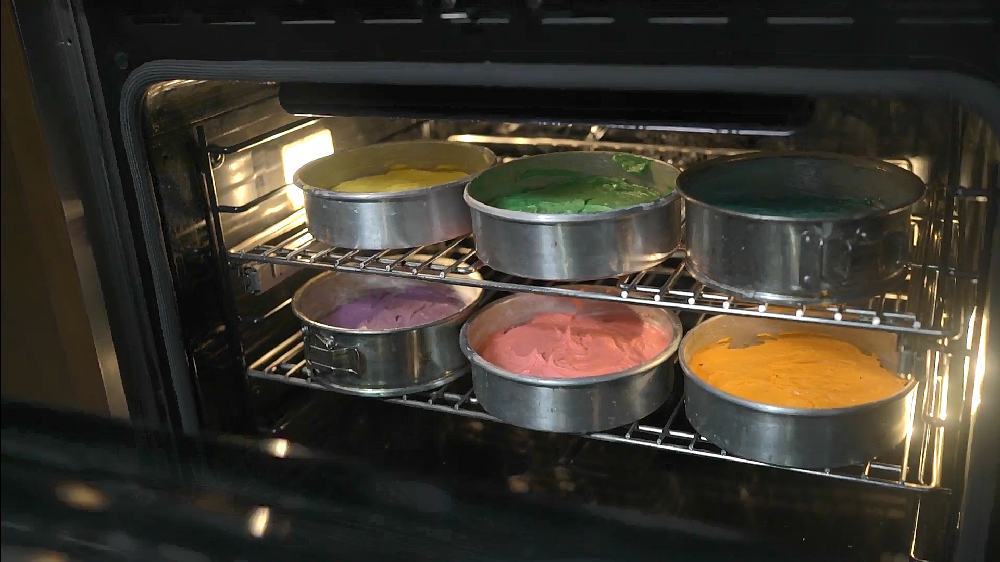

# PLLaVA based on MindSpore

MindSpore implementation & optimization of 
[PLLaVA : Parameter-free LLaVA Extension from Images to Videos for Video Dense Captioning
](https://arxiv.org/abs/2404.16994).

## Dependencies

- CANN: 8.0.RC2 or later
- Python: 3.9 or later
- Mindspore: 2.3.1

## Getting Started
### Downloading Pretrained Checkpoints

Please download the model [here](https://huggingface.co/ermu2001/pllava-7b).
By default, you can put the model under `./models` or your designated directory.

### Requirements

Run the following command to install the required packages:
```bash
pip install -r requirements.txt
```

## Inference

To run the inference, you may use `pllavarun.py` with the following command:

```bash
python pllavarun.py --video path_to_your_video
```

The inference example are shown below:

| Video ID | Sample                           | Caption                                                                                         |
|----------|----------------------------------|------------------------------------------------------------------------------------------------|
| -0J1SbgYLaw_1.mp4    |  | The image shows a person who appears to be a woman with a serious expression. She is wearing a dark top and has a necklace around her neck. There is a blurred background that suggests she might be in an indoor setting, possibly a room with a door or a window. The image is not high resolution, and there are no clear indications of what the video content might be.                               |
| -0og5HrzhpY_0.mp4      |  | The image shows a collection of cake pans inside an oven. Each pan appears to be filled with a different color of batter, suggesting that they are being used to bake cakes with various flavors or decorative effects. The oven is likely preheating, as indicated by the light on the inside of the oven door. This scene is typical of a bakery or home kitchen where cakes are being prepared for baking.     |
| -0UwLhziocc_1.mp4      |  | The image shows two individuals, likely soldiers, engaged in a training exercise. The person on the left is holding a sign, which could be a training aid or a symbol of a specific task or objective. The person on the right is wearing a helmet and appears to be operating a piece of equipment, possibly a vehicle or a piece of machinery. The setting looks like a training ground or a military facility, and the focus seems to be on communication or a specific skill being demonstrated.   |


## Benchmark

### Inference

To test the benchmark, you may use the video `-0J1SbgYLaw_1.mp4` under `./examples`
and run the following command:
```bash
python pllavarun.py --video ./examples/-0J1SbgYLaw_1.mp4 --benchmark
```

|         Model         | Context       | Batch Size | Throughput (tokens/second)|
|-----------------------|---------------|------------|---------------------------|
| pllava-7b| D910*x1-MS2.3 |    1       | 21.2                      |

> Context: {Ascend chip}-{number of NPUs}-{mindspore version}.\
> Throughput (tokens/second): number of generated tokens per second.\
> We use the second round of inference as the benchmark result.
