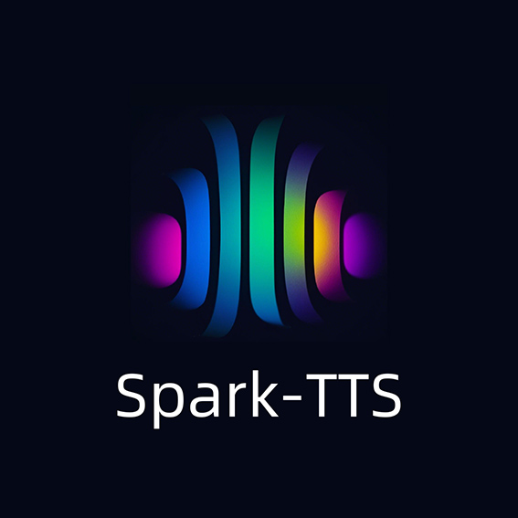
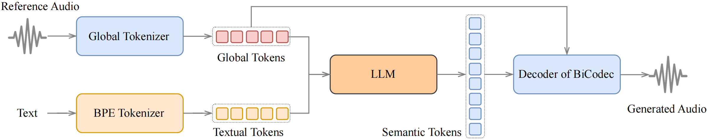
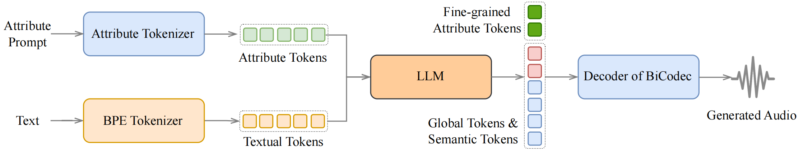

<div align="center">
    <h1>
    Spark-TTS
    </h1>
    <p>
    A MindSpore implementation for inference of <br>
    <b><em>Spark-TTS: An Efficient LLM-Based Text-to-Speech Model with Single-Stream Decoupled Speech Tokens</em></b>
    </p>
    <p>
    
</div>

## Spark-TTS 🔥

### Overview

Spark-TTS is an advanced text-to-speech system that uses the power of large language models (LLM) for highly accurate and natural-sounding voice synthesis. It is designed to be efficient, flexible, and powerful for both research and production use.

### Key Features

- **Simplicity and Efficiency**: Built entirely on Qwen2.5, Spark-TTS eliminates the need for additional generation models like flow matching. Instead of relying on separate models to generate acoustic features, it directly reconstructs audio from the code predicted by the LLM. This approach streamlines the process, improving efficiency and reducing complexity.
- **High-Quality Voice Cloning**: Supports zero-shot voice cloning, which means it can replicate a speaker's voice even without specific training data for that voice. This is ideal for cross-lingual and code-switching scenarios, allowing for seamless transitions between languages and voices without requiring separate training for each one.
- **Bilingual Support**: Supports both Chinese and English, and is capable of zero-shot voice cloning for cross-lingual and code-switching scenarios, enabling the model to synthesize speech in multiple languages with high naturalness and accuracy.
- **Controllable Speech Generation**: Supports creating virtual speakers by adjusting parameters such as gender, pitch, and speaking rate.

---

<table align="center">
  <tr>
    <td align="center"><b>Inference Overview of Voice Cloning</b><br></td>
  </tr>
  <tr>
    <td align="center"><b>Inference Overview of Controlled Generation</b><br></td>
  </tr>
</table>


## 🚀 News

- **[2025-04-08]** MindSpore implementation of SparkTTS inference is now supported.

## 🔧 Dependencies and Installation

| mindspore  | ascend driver  |  firmware   |cann toolkit/kernel |
|:----------:|:--------------:|:-----------:|:------------------:|
|   2.5.0    |    24.1.RC2    | 7.3.0.1.231 |   8.0.0.beta1    |

To install other dependent packages:
```bash
git clone https://github.com/mindspore-lab/mindone.git

# install mindone
cd mindone
pip install -e .

# install requirements
cd examples/sparktts
pip install -r requirements.txt
```


**Model Download**

Download via python:
```python
from huggingface_hub import snapshot_download

snapshot_download("SparkAudio/Spark-TTS-0.5B", local_dir="pretrained_models/Spark-TTS-0.5B")
```

Download via git clone:
```sh
mkdir -p pretrained_models

# Make sure you have git-lfs installed (https://git-lfs.com)
git lfs install

git clone https://huggingface.co/SparkAudio/Spark-TTS-0.5B pretrained_models/Spark-TTS-0.5B
```

**Prepare Weight Format**

convert `.bin` weight (wav2vec2-large-xlsr-53) format from `pytorch_model.bin` to `model.safetensors`

```shell
python convert.py --pt_filename where_bin_file --sf_filename where_safetensors_file --config_path where_{config.json}_file

# example as:
python convert.py --pt_filename pretrained_models/Spark-TTS-0.5B/wav2vec2-large-xlsr-53/pytorch_model.bin --sf_filename pretrained_models/Spark-TTS-0.5B/wav2vec2-large-xlsr-53/model.safetensors --config_path /pretrained_models/Spark-TTS-0.5B/wav2vec2-large-xlsr-53/config.json
```

**Basic Usage**

You can simply run the demo with the following commands:
``` sh
bash example/infer.sh
```

Alternatively, you can directly execute the following command in the command line to perform inference：

``` sh
python -m cli.inference \
    --text "text to synthesis." \
    --save_dir "path/to/save/audio" \
    --model_dir pretrained_models/Spark-TTS-0.5B \
    --prompt_text "transcript of the prompt audio" \
    --prompt_speech_path "path/to/prompt_audio"
```


## **Demos**

Here are some demos generated by Spark-TTS using zero-shot voice cloning.

``` sh
python -m cli.inference \
    --text "我觉得这种运动其实不是说靠机会的，我觉得对每个人来讲，像我们歌手来讲，我觉得其实都是你要自己去努力，然后才可以达到自己的梦想。" \
    --save_dir "example/results" \
    --model_dir pretrained_models/Spark-TTS-0.5B \
    --prompt_text "对我来讲是一种荣幸，但是也是，压力蛮大的。不过我觉得是一种，嗯，很好的一个挑战。" \
    --prompt_speech_path "src/demos/jay/jay_prompt.wav"
```

<table>
<tr>
<td align="center">

**周杰伦**
</td>
<td align="center">

</td>
<td align="center">

[jay.webm](https://github.com/user-attachments/assets/9c34d0e0-e94f-4454-a279-1424fafbf67b)


</td>
</tr>
</table>

---

``` sh
python -m cli.inference \
    --text "我们知道技术发展很快，但人工智能的发展更为迅速。它已经在改变我们的生活——从我们的工作和联系方式，到我们如何应对世界上最大的挑战。" \
    --save_dir "example/results" \
    --model_dir pretrained_models/Spark-TTS-0.5B \
    --prompt_text "In short, we embark on a mission to make America great again, for all Americans." \
    --prompt_speech_path "src/demos/trump/trump_prompt.wav"
```

<table>
<tr>
<td align="center">

**Trump**
</td>
<td align="center">

</td>
<td align="center">

[trump_cn.webm](https://github.com/user-attachments/assets/36002a91-785a-4795-9454-1f905af9e675)


</td>
</tr>
</table>

---
Here are some demos generated by Spark-TTS using controlled generetion.

``` sh
python -m cli.inference \
    --text "身临其境，换新体验。塑造开源语音合成新范式，让智能语音更自然。" \
    --save_dir 'example/results' \
    --model_dir "pretrained_models/Spark-TTS-0.5B" \
    --prompt_text "吃燕窝就选燕之屋，本节目由26年专注高品质燕窝的燕之屋冠名播出。豆奶牛奶换着喝，营养更均衡，本节目由豆本豆豆奶特约播出。" \
    --prompt_speech_path "example/prompt_audio.wav" \
    --gender female \
    --pitch very_high \
    --speed very_high
```

<table>
<tr>
<td align="center">

**female**
</td>
<td align="center">

</td>
<td align="center">

[ads_coarse_fe_vh_vh.webm](https://github.com/user-attachments/assets/321ba9d4-8087-47ea-8d0c-ea3040ad86dc)


</td>
</tr>
</table>


## Citation

```
@misc{wang2025sparktts,
      title={Spark-TTS: An Efficient LLM-Based Text-to-Speech Model with Single-Stream Decoupled Speech Tokens},
      author={Xinsheng Wang and Mingqi Jiang and Ziyang Ma and Ziyu Zhang and Songxiang Liu and Linqin Li and Zheng Liang and Qixi Zheng and Rui Wang and Xiaoqin Feng and Weizhen Bian and Zhen Ye and Sitong Cheng and Ruibin Yuan and Zhixian Zhao and Xinfa Zhu and Jiahao Pan and Liumeng Xue and Pengcheng Zhu and Yunlin Chen and Zhifei Li and Xie Chen and Lei Xie and Yike Guo and Wei Xue},
      year={2025},
      eprint={2503.01710},
      archivePrefix={arXiv},
      primaryClass={cs.SD},
      url={https://arxiv.org/abs/2503.01710},
}
```


## ⚠️ Usage Disclaimer

This project provides a zero-shot voice cloning TTS model intended for academic research, educational purposes, and legitimate applications, such as personalized speech synthesis, assistive technologies, and linguistic research.

Please note:

- Do not use this model for unauthorized voice cloning, impersonation, fraud, scams, deepfakes, or any illegal activities.

- Ensure compliance with local laws and regulations when using this model and uphold ethical standards.

- The developers assume no liability for any misuse of this model.

We advocate for the responsible development and use of AI and encourage the community to uphold safety and ethical principles in AI research and applications. If you have any concerns regarding ethics or misuse, please contact us.
