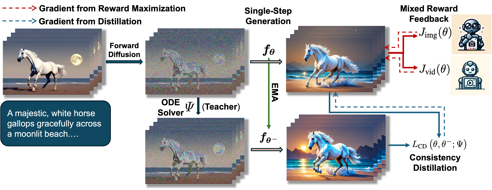

# T2V-Turbo

This repository provides a Mindspore implementation of [T2V-Turbo](https://github.com/Ji4chenLi/t2v-turbo) from the following papers.

**T2V-Turbo: Breaking the Quality Bottleneck of Video Consistency Model with Mixed Reward Feedback**  
Jiachen Li, Weixi Feng, Tsu-Jui Fu, Xinyi Wang, Sugato Basu, Wenhu Chen, William Yang Wang

Paper: https://arxiv.org/abs/2405.18750




## 📌 Features

- [x] T2V-Turbo-VC2 Inference
- [x] T2V-Turbo-MS Inference
- [x] T2V-Turbo-VC2 Training

## 🏭 Requirements

The scripts have been tested on ascend [910b] under the following requirements:

| mindspore | ascend driver | firmware | cann toolkit/kernel |
| --------- | ------------- | -------- | ------------------- |
| [2.3.1](https://www.mindspore.cn/)  | 24.1.RC2 |7.3.0.1.231 |	[`CANN 8.0.RC2.beta1`](https://www.hiascend.com/software/cann) |

#### Installation Tutorials:

1. Install Mindspore==2.3.1 according to the [official tutorials](https://www.mindspore.cn/install)
2. Ascend users please install the corresponding *CANN 8.0.RC2.beta1* in [community edition](https://www.hiascend.com/developer/download/community/result?module=cann&cann=8.0.RC2.beta1) as well as the relevant driver and firmware packages in [firmware and driver](https://www.hiascend.com/hardware/firmware-drivers/community), as stated in the [official document](https://www.mindspore.cn/install/#%E5%AE%89%E8%A3%85%E6%98%87%E8%85%BEai%E5%A4%84%E7%90%86%E5%99%A8%E9%85%8D%E5%A5%97%E8%BD%AF%E4%BB%B6%E5%8C%85).
3. Install the pacakges listed in requirements.txt with `pip install -r requirements.txt`


## Fast and High-Quality Text-to-video Generation 🚀


### 4-Step Results of T2V-Turbo

### 8-Step Results of T2V-Turbo


## 🎯 Model Checkpoints

|Model|Resolution|Checkpoints|
|:---------|:---------|:--------|
|T2V-Turbo (VC2)|320x512|[model.ckpt] [unet_lora.pt] |
|T2V-Turbo (MS)|256x256|[model.ckpt] [unet_lora.ckpt]|


## 🚀 Inference


### T2V-Turbo

> To play with our T2V-Turbo (VC2), please follow the steps below:

1. Download the `unet_lora.pt` of our T2V-Turbo (VC2) [here](https://huggingface.co/jiachenli-ucsb/T2V-Turbo-VC2/blob/main/unet_lora.pt).

2. Launch the gradio demo with the following command:
```python
python app.py \
  --unet_dir PATH_TO_UNET_LORA.pt \
  --base_model_dir PATH_TO_VideoCrafter2_MODEL_CKPT \
  --version v1
```

> To play with our T2V-Turbo (MS), please follow the steps below:

1. Download the `unet_lora.pt` of our T2V-Turbo (MS) [here](https://huggingface.co/jiachenli-ucsb/T2V-Turbo-MS/blob/main/unet_lora.pt).

2. Launch the gradio demo with the following command:
```python
python app_ms.py --unet_dir PATH_TO_UNET_LORA.pt
```

## 🏋️ Training

### T2V-Turbo
To train T2V-Turbo (VC2), first prepare the data and model as below
1. Download the model checkpoint of VideoCrafter2 [here](https://huggingface.co/VideoCrafter/VideoCrafter2/blob/main/model.ckpt).
2. Prepare the [WebVid-10M](https://github.com/m-bain/webvid) data. Save in the `webdataset` format.
3. Download the [InternVid2 S2 Model](https://huggingface.co/OpenGVLab/InternVideo2-CLIP-1B-224p-f8) 
4. Set `--pretrained_model_path`, `--train_shards_path_or_url` and `video_rm_ckpt_dir` accordingly in `train_t2v_turbo_vc2.sh`.

Then run the following command:
```
bash train_t2v_turbo_v1.sh
```

## Benchmarking

Experiments are tested on ascend [910b] with mindpsore [2.3.1].

### Inference Performance

### Training Performance